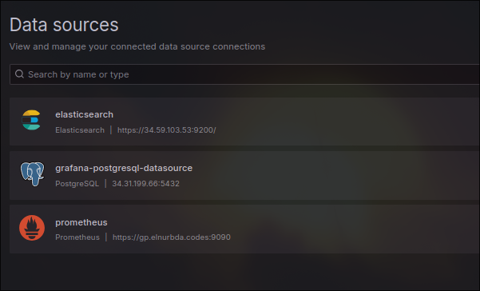
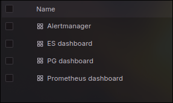
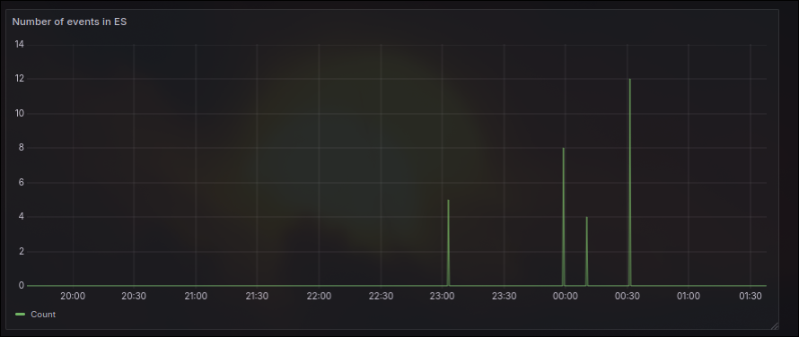
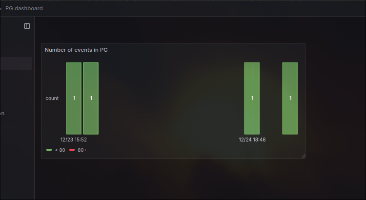
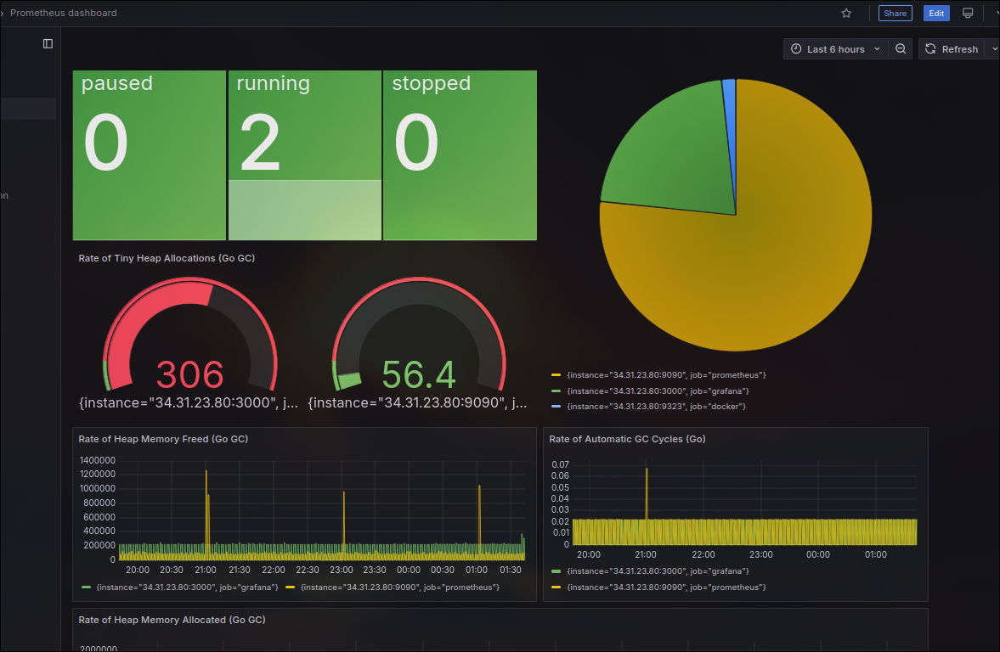
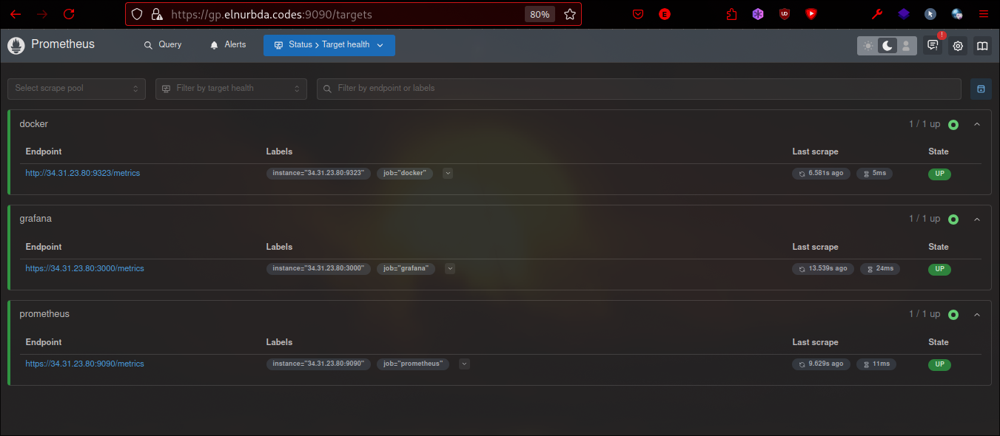

# Setup

## Documentation for Setting Up Grafana and Prometheus with Docker

This guide will walk you through setting up **Grafana** and **Prometheus** using Docker, with SSL encryption and basic authentication. Follow the steps below to configure the necessary components.

---

### 1. **Prerequisites**

Before starting, ensure that you have the following installed on your machine:

- Docker and Docker Compose
- Python 3 (for password encryption)

---

### 2. **Directory Structure Overview**

```bash
grafana-prometheus-setup/
├── docker-compose.yml         # Docker Compose configuration
├── enc-pass.py                # Python script for password encryption
├── grafana                    # Grafana configuration directory
├── prometheus                 # Prometheus configuration directory
│   ├── prometheus.yml         # Prometheus configuration
│   └── web.yml                # Web server configuration (basic auth & SSL)
├── README.md                  # Documentation for setup
└── ssl                        # SSL certificates directory
    ├── selfsigned.crt         # Self-signed SSL certificate
    └── selfsigned.key         # Self-signed SSL key
```

---

### 3. **Setting Up SSL Certificates**

You need SSL certificates to enable HTTPS for both Prometheus and Grafana. To create a self-signed certificate, follow these steps:

1. Navigate to the `ssl` directory:

   ```bash
   cd ~/monitoring/ssl
   ```

2. Run the following OpenSSL command to generate the certificate and key:

   ```bash
   openssl req -x509 -nodes -days 365 -newkey rsa:2048 -keyout selfsigned.key -out selfsigned.crt \
     -subj "/C=US/ST=State/L=City/O=Organization/OU=IT Department/CN=yourdomain.com"
   ```

   This will create:
   - `selfsigned.crt` (SSL certificate)
   - `selfsigned.key` (SSL private key)

---

### 4. **Set Permissions**

Ensure that the correct file permissions are set for Grafana, Prometheus, and SSL files:

```bash
sudo chown -R 472:472 grafana            # Set ownership for Grafana
sudo chown -R 65534:65534 prometheus     # Set ownership for Prometheus
sudo chmod -R 755 ssl                    # Set correct permissions for SSL folder
```

---

### 5. **Configure Prometheus**

You need to configure Prometheus to use HTTPS, basic authentication, and scrape data from both Prometheus and Grafana. Update the `prometheus.yml` file located in the `prometheus/` directory.

Example content of `prometheus.yml`:

```yaml
global:
  scrape_interval: 15s  # Set the scrape interval

scrape_configs:
  - job_name: 'prometheus'
    scheme: https
    tls_config:
      insecure_skip_verify: true  # Skip SSL verification (only for self-signed certs)
    basic_auth:
      username: admin            # Basic auth username for Prometheus
      password: securepassword   # Password (encrypted via enc-pass.py)
    static_configs:
      - targets: ['<IP>:9090']    # Prometheus endpoint (over HTTPS)

  - job_name: 'grafana'
    scheme: https
    tls_config:
      insecure_skip_verify: true
    static_configs:
      - targets: ['<IP>:3000']    # Grafana endpoint (over HTTPS)

  - job_name: "docker"
    static_configs:
      - targets: ["<IP>:9323"]    # Docker metrics endpoint
```

Make sure to replace `<IP>` with the appropriate IP addresses for Prometheus and Grafana.

---

### 6. **Configure Prometheus Web Server (SSL & Basic Authentication)**

Prometheus web configuration is handled via the `web.yml` file. Update the `web.yml` file in the `prometheus/` directory for SSL and basic authentication.

Example content of `web.yml`:

```yaml
tls_server_config:
  cert_file: /etc/ssl/selfsigned.crt   # Path to SSL certificate
  key_file: /etc/ssl/selfsigned.key    # Path to SSL key

basic_auth_users:
  admin: $2b$12$ftgt4rfrg.gtr4tfv/fr3erfsddv/fvgtre4egtrregtfr  # Encrypted password
```

**Important:** The password in `basic_auth_users` is encrypted. To encrypt a password, use the `enc-pass.py` Python script.

---

### 7. **Encrypt Password (Optional)**

If you need to generate an encrypted password for Prometheus, you can use the `enc-pass.py` script:

1. Run the Python script:

   ```bash
   python3 enc-pass.py
   ```

2. This will prompt you to enter a password. The script will output an encrypted password string that you can use in the `web.yml` file for Prometheus.

---

### 8. **Configure Docker Daemon**

To expose Docker metrics, add the following configuration to the Docker daemon:

1. Edit the Docker daemon configuration file (`/etc/docker/daemon.json`):

   ```json
   {
     "metrics-addr": "0.0.0.0:9323",
     "experimental": true
   }
   ```

2. Restart Docker:

   ```bash
   sudo systemctl restart docker
   ```

---

### 9. **Start the Services with Docker Compose**

To start Grafana and Prometheus using Docker Compose, run the following command:

```bash
docker compose up -d
```

This will start the services in detached mode.

---

### 10. **Access Grafana and Prometheus**

- **Prometheus:** You can access Prometheus at `https://<IP>:9090`.
- **Grafana:** You can access Grafana at `https://<IP>:3000`.

Use the following credentials for basic authentication:

- Username: `admin`
- Password: The encrypted password you set in the `web.yml` file for Prometheus.

---

### 11. **Verify the Setup**

1. **Grafana:** After logging in, add Prometheus as a data source in Grafana:
   - Go to Grafana UI → **Configuration** → **Data Sources** → **Add Data Source**.
   - Choose **Prometheus**, and configure the URL to `https://<IP>:9090`.

2. **Prometheus:** Verify that Prometheus is scraping data from Grafana and Docker by checking the **Targets** in the Prometheus UI (`https://<IP>:9090/targets`).

---

This concludes the setup process for Grafana and Prometheus using Docker. For additional configurations, you can modify the `grafana` and `prometheus` directories to suit your needs.

## Documentation for Settint Up Dashboards

### Grafana Data Sources

It is connected with Postgresql Database, Elasticsearch and Prometheus

> 

### Grafana Dashboards

There are some Dashboards built for monitoring

> 

ES Dashboard

> 

PG Dashboard



Prometheus Dashboard



### Prometheus

Prometheus monitors itself, Grafana, Docker for now


